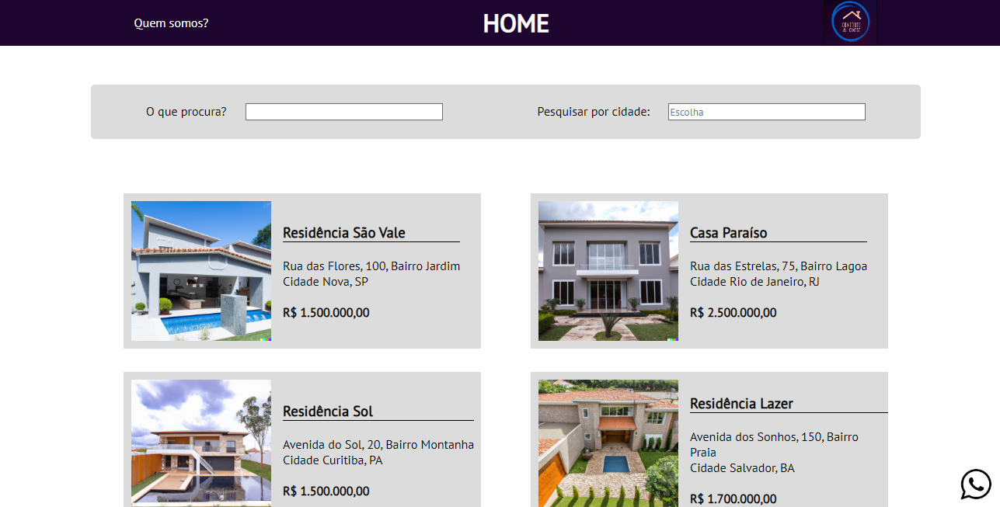
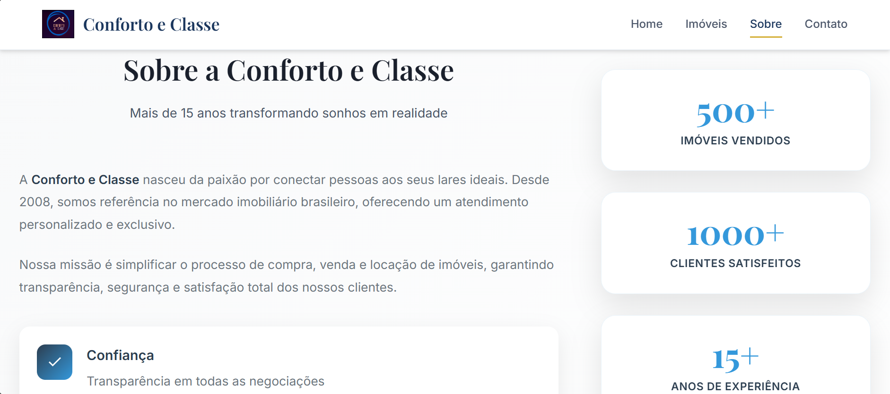
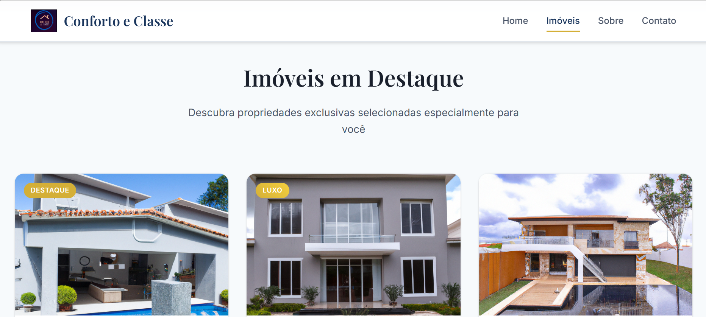

# 🏡 Imobiliária Conforto e Classe

> Site moderno e responsivo para imobiliária fictícia desenvolvido com HTML5, CSS3 e JavaScript

## 🚀 Demonstração

**🔗 [Acesse o site aqui](https://imobiliaria-conforto-e-classe.vercel.app)**

## 📸 Screenshots

### Página Inicial


### Sobre nós


### Catálogo de Imóveis


## ✨ Funcionalidades

- **🎨 Design Moderno**: Interface elegante e profissional
- **📱 Totalmente Responsivo**: Funciona perfeitamente em todos os dispositivos
- **🔍 Sistema de Busca**: Filtragem por tipo de imóvel e localização
- **🏠 Catálogo de Propriedades**: Showcase de imóveis com detalhes completos
- **📧 Formulário de Contato**: Sistema de contato funcional com validação
- **⚡ Navegação Suave**: Scroll suave entre seções
- **🎯 Menu Responsivo**: Menu hamburger para dispositivos móveis

## 🛠️ Tecnologias Utilizadas

- **HTML5**: Estrutura semântica e acessível
- **CSS3**: Estilos modernos com Flexbox e Grid
- **JavaScript ES6+**: Interatividade e funcionalidades dinâmicas
- **Google Fonts**: Tipografia profissional (Inter + Playfair Display)
- **SVG Icons**: Ícones vetorizados para melhor qualidade

## 📁 Estrutura do Projeto

```
conforto_e_classe/
├── index.html          # Página principal
├── css/
│   ├── header.css      # Estilos do cabeçalho
│   ├── pageUm.css      # Estilos principais
│   └── pageDois.css    # Estilos da página sobre
├── js/
│   └── script.js       # Funcionalidades JavaScript
├── html/
│   └── pageDois.html   # Página "Sobre Nós"
└── img/                # Imagens e recursos visuais
    ├── casas/          # Fotos dos imóveis
    └── logos/          # Logos e ícones
```

## 🎯 Seções do Site

1. **Home**: Apresentação principal com sistema de busca
2. **Imóveis**: Catálogo com cards interativos das propriedades
3. **Sobre**: História da empresa e valores corporativos
4. **Contato**: Formulário de contato e informações da empresa

## 💡 Características Técnicas

- ✅ **SEO Otimizado**: Meta tags e estrutura semântica
- ✅ **Performance**: Código otimizado e imagens comprimidas
- ✅ **Acessibilidade**: Suporte a leitores de tela e navegação por teclado
- ✅ **Cross-browser**: Compatível com todos os navegadores modernos
- ✅ **Mobile First**: Desenvolvido pensando primeiro em dispositivos móveis

## 🔧 Como Executar

1. Clone o repositório:
```bash
git clone https://github.com/DanielTomazi/ImobiliariaConforto-e-Classe.git
```

2. Acesse a pasta do projeto:
```bash
cd ImobiliariaConforto-e-Classe
```

3. Abra o arquivo `conforto_e_classe/index.html` no seu navegador ou use um servidor local:
```bash
# Usando Python
cd conforto_e_classe
python -m http.server 8000

# Usando Node.js (npx)
npx serve conforto_e_classe
```

## 📝 Sobre o Projeto

Este projeto foi desenvolvido como um site para uma imobiliária fictícia chamada "Conforto e Classe". O objetivo foi criar uma experiência digital moderna e profissional que transmitisse confiança e sofisticação para potenciais clientes.

**⚠️ Aviso**: Este é um projeto educacional. A empresa "Conforto & Classe" é fictícia, assim como os produtos, preços e informações apresentadas.

## 🤝 Contribuição

Contribuições são bem-vindas! Sinta-se à vontade para:

- 🐛 Reportar bugs
- 💡 Sugerir melhorias
- 🔧 Enviar pull requests

## 📄 Licença

Este projeto está sob a licença MIT. Veja o arquivo [LICENSE](LICENSE) para mais detalhes.

## 👨‍💻 Autor

**Daniel Tomazi**

- 🔗 LinkedIn: [linkedin.com/in/daniel-oliveira](https://linkedin.com/in/daniel-oliveira)
- 🐙 GitHub: [@DanielTomazi](https://github.com/DanielTomazi)
